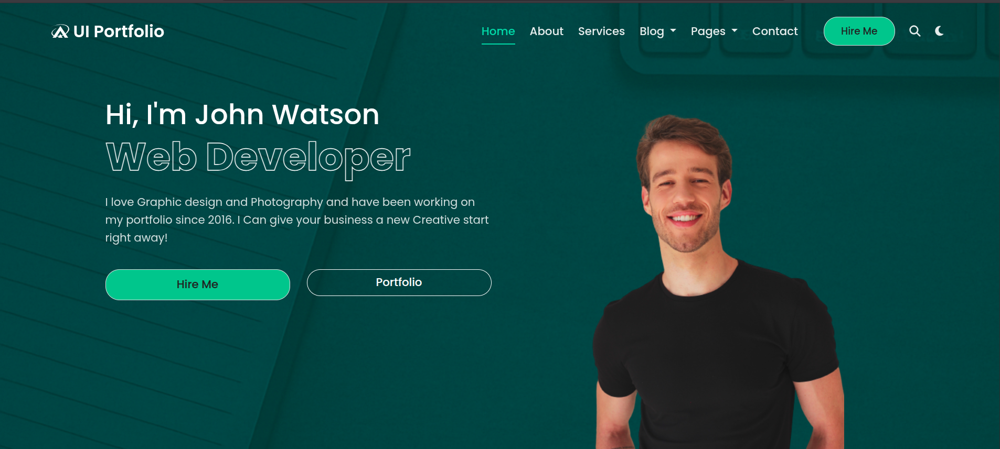

# 🎨 UI Portfolio - John Watson



A sleek and responsive portfolio website for **John Watson**, a UI/UX designer and web developer. Built using HTML, CSS, and Bootstrap 5, the website showcases personal projects, partner collaborations, and contact details, all wrapped in a clean and modern layout.

---

## 🔗 Live Preview

🌐 **View Website:** [Live Demo](https://kimaka254.github.io/plp_web_group_assignment/)  
> *(Hosted on GitHub Pages)*

---

## 🌟 Features

- ✅ Fully responsive across all devices  
- 🧑‍🎨 Clean, modern UI with green accent theme  
- ✨ Smooth animations and hover effects  
- 🌙 Dark mode toggle
- 🧩 Semantic HTML and modular code structure  
- ⚡ Optimized for performance and accessibility  

---

## 🛠 Technologies Used

- **HTML5**  
- **CSS3**  
- **Bootstrap 5**  
- **Font Awesome 5**  
- **Google Fonts (Poppins)**  

---

## 👥 Team Members

| Name            | Role                | Contact                     |
|-----------------|---------------------|-----------------------------|
| Elsy Kimaka    |  Developer  | elsykimaka02@gmail.com |
| Tshimoloho hlapane    | Developer        |  tshimo.hlapane@gmail.com|

## 🚀 Getting Started

1. Clone the repository:
   ```bash
   git clone https://github.com/kimaka254/plp_web_group_assignment.git
2. Open the project folder.

3. Open index.html in your browser.

